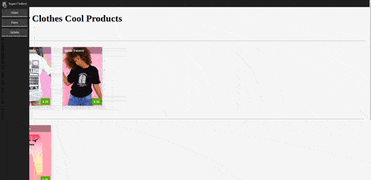

# Jquery Store Page

## Learning Objectives

| Students Will Be Able To: |
| --- |
| Leverage Jquery to create dynamically loaded content. |
| Add and remove event listeners based on a condition. |
| Understand order of execution on listeners and created content. |

## Set Up

- Start by cloning this repo down to your own machine. `$ git clone {url from repo}`
- Navigate into the directory. `$ cd Jquery-Store`
- Open the project in VS Code: `$ code .`
- We will begin working in the starter-code directory.

> NOTE: This lesson does provide a solution branch in case you need to refrence it. 